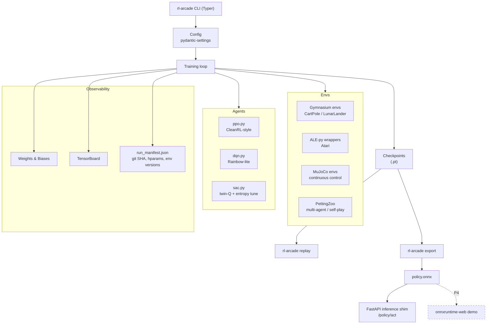

# ARCHITECTURE

High-level diagram of `rl-arcade`.  The repo is a CLI around three layers:
**envs**, **agents**, **training/observability**.  Trained artefacts drop out
the bottom as checkpoints and ONNX graphs.

## Data flow (PPO, one training iteration)

1. `SyncVectorEnv` steps N parallel envs; observations returned as tensor.
2. Actor network produces action + log-prob; step envs, collect reward.
3. After `n_steps` per env, compute GAE advantages + returns.
4. For `update_epochs`, shuffle rollout, compute clipped surrogate loss,
   value loss (optionally clipped), entropy bonus; SGD step.
5. Log to wandb, checkpoint every `save_freq` updates, write manifest on exit.

## Reproducibility contract

Every invocation:
- seeds torch/numpy/env
- records git SHA and `uv lock` hash into manifest
- logs installed `gymnasium` / `ale-py` / `torch` / CUDA versions
- stores checkpoint and manifest under `runs/{run_id}/`

`rl-arcade replay <run_id>` reconstructs env + model from manifest + checkpoint,
rolls 10 evaluation episodes, and asserts the evaluation reward is within the
manifest's stored eval-reward band (±2σ).  If it isn't, we raise.

## Deployment surface (P4)

- `rl-arcade export <run_id>` → `artefacts/{run_id}/policy.onnx`
- `docker compose up inference` → FastAPI on :8000
  - `GET /healthz`
  - `POST /policy/{run_id}/act` — body: `{"obs": [...]}`, returns `{"action": ...}`
- Static demo site reads ONNX via onnxruntime-web (stretch).
