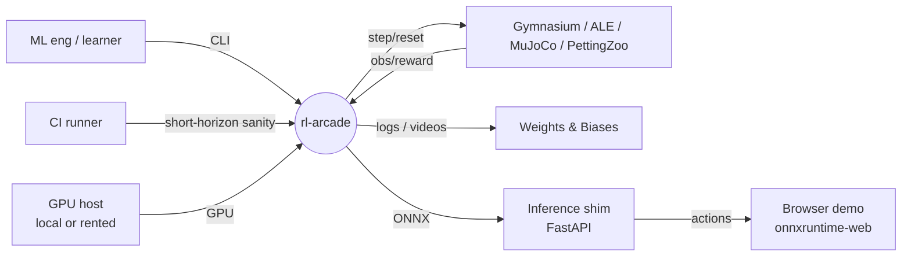
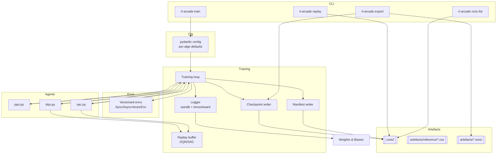
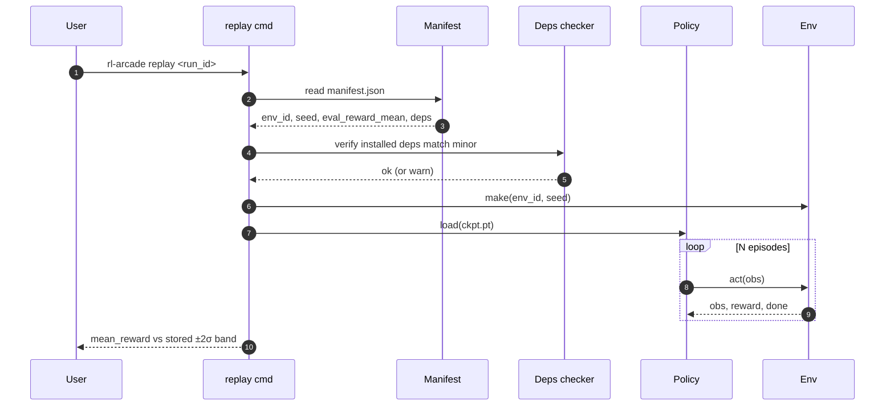
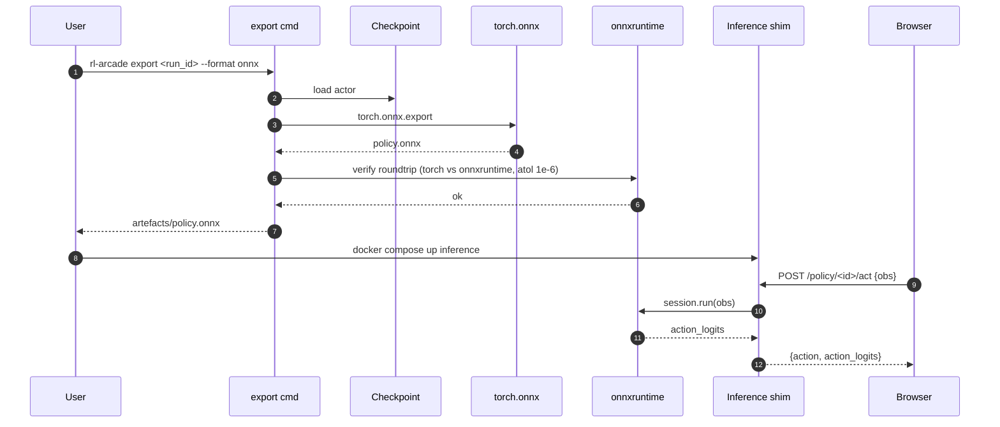
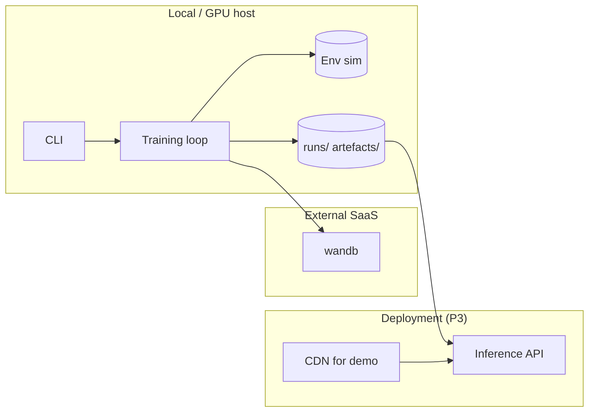

# DFD — rl-arcade

## Level 0 — Context



## Level 1 — Training + export



## Level 2 — PPO training iteration

```mermaid
sequenceDiagram
  autonumber
  participant T as Train loop
  participant V as VectorEnv
  participant A as Actor-Critic
  participant L as Logger
  loop collect rollout
    T->>V: step(action)
    V-->>T: obs, reward, done
    T->>A: value(obs); logprob(action)
  end
  T->>T: compute GAE advantages + returns
  loop update_epochs
    T->>T: minibatch iterate rollout
    T->>A: policy ratio r_t = pi_new / pi_old
    T->>A: clipped surrogate loss + value loss + entropy bonus
    T->>A: grad step + clip norm
  end
  T->>L: log KL, clipfrac, losses, reward
  T->>T: anneal lr, increment step
```

## Level 2 — Replay from manifest



## Level 2 — ONNX export + serving



## Data stores

| Store | Purpose | Retention |
|-------|---------|-----------|
| `runs/<run_id>/` | Manifest, checkpoint, evaluation stats | Until purged |
| `artefacts/reference/` | Reference CSVs for (algo × env) | Versioned in git |
| `artefacts/<run_id>/policy.onnx` | Portable policy | Ephemeral |
| wandb | Experiment-tracking store | Managed |

## Trust boundaries



## Invariants

- `manifest.json` is written atomically at end-of-training; partial runs are
  clearly marked `status="incomplete"`.
- Reference-curve CSV filenames encode `(algo, env_id, n_seeds)`.
- ONNX export runs a roundtrip test before being considered valid.
- No training code path uploads raw data to a third party without explicit
  wandb config (wandb_mode=disabled is respected).
- Seeds are recorded in the manifest; a rerun with the same manifest +
  deterministic flag must reproduce within band.
